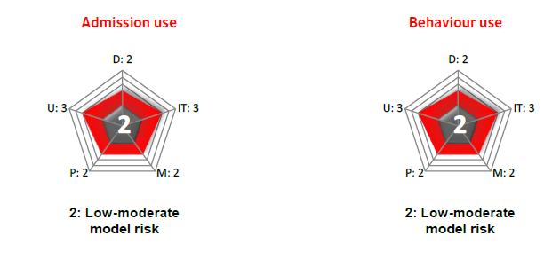

# Default Probability & Credit Score API

[](https://codeclimate.com/github/Neurus1970/models/maintainability) [](https://codeclimate.com/github/Neurus1970/models/test_coverage)

An API exposing the credit score and default probability for the individual and SMEs debtors in the market.
The score is updated every month and __provides an estimated default probability with a 12 months time horizon__, this is produced by a Machine Learning model certified by the corporation. The mehtod by wich the score is calculated is beyond the scope of this document. The main objective of this document is to provide a guide to use this API and allow the integration with other systems that can implement a ReST interface to request the default probability (or credit score) of a particular individual or SME.

There are two endpoints for this models `/individuals` which provides the score information asociated with the physical persons, and the `/pymes` endpoint grants access to SMEs operating in the regulated market.

## Physical persons score

The use cases recomended by the corporation for this data are:



### Performing a request

To get a list with the analyzed individuals with the most up to date score calification, you should execute

```http
GET /models/scoring/individuals
```

The API will provide the followin response

```javascript
{
  "searchTime": 0,
  "hits": 1073,
  "pageSize": 50,
  "dataPages": 22,
  "nextPage": "/models/scoring/individuals?page=2",
  "debtors": []
}
```

Where each element in the array `debtors` has this structure

```javascript
{
  "id": "3890089",
  "name": "DOS SANTOS QUESADA, ALICIA LORENZA",
  "default_probability": {
    "within_3_months": 0,
    "within_6_months": 0,
    "within_9_months": 0,
    "within_12_months": 0.018247683
  },
  "_links": {
    "href": "/models/scoring/individuals/3890089"
  },
  "median": 0.045284033,
  "mean": 0.09683235834389563,
  "stdDev": 0.1357565412061047,
  "rank": 1
}
```  

On top of the score for each particualr individual, the API provides reference data for the whole market in which this individual operates, these are

| Market data                    | description                                                                                      |
| ------------------------------ | ------------------------------------------------------------------------------------------------ |
| `"median": 0.045284033`        | the __median__ of the default probability of the market in the current month                     |
| `"mean": 0.09683235834389563`  | the __mean__ of the default probability of the market in the current month                       |
| `"stdDev": 0.1357565412061047` | the __standard deviation__ of the default probability of the market in the current month         |
| `"rank": 1`                    | the __percentil rank__ of the default probability [ 1 .. 10 ] of the market in the current month |

By default the API provides a paged list with 50 items in each page, it can be changed using the `pageSize=<n>` modificator in the query string, where "n" is an integer number. It can't be greater than the `maxPageSize` parameter configured by the system administrator (tipically 50 items per page). If you require more than 50 items per page, you problably would require a different interface (not a ReST API) to acces the score califications. There is a file system interface wich provides the entire dataset that you can acces. Please contact the system administrators to access this information.

The API also provides some hypermedia controls that allow you to navigate through the data pages. These are disigned to be used in conjunction with the search method implemented, that can filter by any debtor name (or part of it)

```http
GET /models/scoring/individuals?name=CARL MARTIN&pageSize=10
```

will display a list of individuals whose names contains "CARL" and "MARTIN", the result set will be paginated in 10 items at a time

* <ins>CARL</ins>OS <ins>MARTIN</ins>EZ
* <ins>CARL</ins>A NUÑEZ <ins>MARTIN</ins>ELLI
* <ins>CARL</ins> <ins>MARTIN</ins>

are all valid search results. In order to navigate through the results you can use

```http
GET /models/scoring/individuals?name=CARL MARTIN&pageSize=10&page=2
```

will display the second page of the dataset

### Additional controls

| Hypermedia control                                  | function                            |
| --------------------------------------------------- | ----------------------------------- |
| `"nextPage": "/models/scoring/individuals?page=2"`  | provides the next page of data      |
| `"prevPage": "/models/scoring/individuals?page=1"`  | provides the previous page of data  |
| `"href": "/models/scoring/individuals/3890089"`     | link to the scored individual       |
