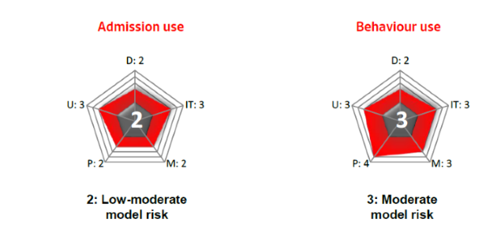

# Scoring model API

[](https://codeclimate.com/github/Neurus1970/models/maintainability) [](https://codeclimate.com/github/Neurus1970/models/test_coverage)

An API exposing the credit score and default probability for the individual and SMEs debtors in the market.
The score is updated every month with a 12 months time horizon by a Machine Learning model certified by the corporation. The mehtod by wich the score is calculated is beyond the scope of this document. The main objective of this document is to provide a guide to use this API.

There are two endpoints for this models `/individuals` which provides the score information asociated with the physical persons, and the `/pymes` endpoint grants access to SMEs operating in the regulated market.

## Physical persons score


### Performing a request

To get a list with the analyzed individuals with the most up to date score calification, you should execute

```http
GET /models/scoring/individuals
```

The API will provide the followin response

```javascript
{
  "searchTime": 0,
  "hits": 1073,
  "pageSize": 50,
  "dataPages": 22,
  "nextPage": "/models/scoring/individuals?page=2",
  "debtors": []
}
```

Where each element in the array `debtors` has this structure

```javascript
{
  "id": "3890089",
  "name": "DOS SANTOS QUESADA, ALICIA LORENZA",
  "default_probability": {
    "within_3_months": 0,
    "within_6_months": 0,
    "within_9_months": 0,
    "within_12_months": 0.018247683
  },
  "_links": {
    "href": "/models/scoring/individuals/3890089"
  },
  "median": 0.045284033,
  "mean": 0.09683235834389563,
  "stdDev": 0.1357565412061047,
  "rank": 1
}
```  

By default the API provides a paged list with 50 items in each page, the API also provides some hypermedia controls 

| Hypermedia control                                  | function                            |
| --------------------------------------------------- | ----------------------------------- |
| `"nextPage": "/models/scoring/individuals?page=2"`  | provides the next page of data      |
| `"prevPage": "/models/scoring/individuals?page=1"`  | provides the previous page of data  |
| `"href": "/models/scoring/individuals/3890089"`     | link to the scored individual       |


## SMEs score




